# Azure App Services Node.js Workshop
This workshop is a step-by-step guide to exploring the features of app services using a standard Node.js sample application.

This is based on our documentation here https://docs.microsoft.com/en-gb/azure/app-service/quickstart-nodejs?tabs=linux&pivots=development-environment-azure-portal

What this workshop demonstrates is how to:
1. [Create a web app in the Azure portal](#Create-a-Web-App)
2. [A tour of app services](#A-tour-of-app-service-features)
3. [Create a sample app code on your machine (in Node.js)](#Creating-and-building-the-demo-app)
4. [Deploy to your web app on Azure](#Deploy-the-Express-application-to-an-Azure-Web-App)
5. [Validate it is working and inspect the deployed web app](#Check-that-your-application-has-deployed-correctly)
6. [Demonstrate how to use deployment slots for blue/green deployments](#Blue/Green-Deployments-using-Deployment-Slots)
7. [How to inject variables or secrets into your web app](#Injecting-variables-and-secrets-into-a-web-app)
8. [How to use key vault to store a secret that the web app then uses](#Using-Azure-Key-Vault-to-hold-secrets)

## Prerequisites
1. Access to an Azure subscription or resource group with contributor rights.
2. Command line in Windows/WSL or a Mac (this guide will concentrate on Windows, but it should be very similar in Linux (WSL) or a Mac
3. Visual Studio Code with the *Azure Tools* extension installed (this extension is published by Microsoft)
4. A version of Node.js 

## Create a Web App
It may be a little confusing, but web apps in Azure come under the product "app services". This is because, there are several types of web app, but they all use a common infrastrcture. So, if you hear app services on Azure - these are web apps. There are other means of hosting web apps, but app services is the main one and is the subject of this workshop.

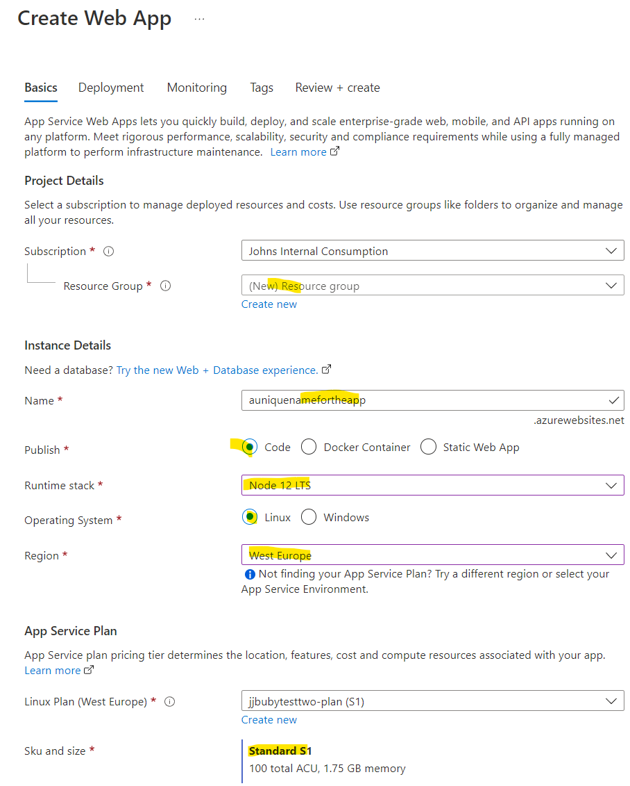

You need to have:
1. A globally unique name
2. Choose Node as the runtime
3. Your favourite Azure region
4. A service plan of at least an S1 type (this will be needed for later stages)

Once deployed, your new app should have a holding page:
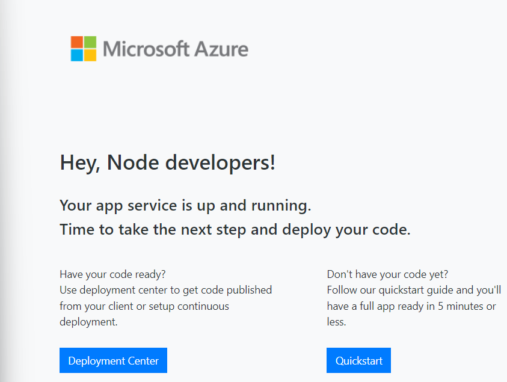


## A tour of app service features

Spend some time looking at some of the features of the web app. A list of the more useful ones is shown below:
1. Overview - URL
2. Metrics
3. Service plan
4. Scale up and scale out
5. Configuration/General Settings - can see the node version
6. Log stream
7. Diagnostic settings
8. App Service logs
9. Advanced tools - the Kudu console - SSH or Bash
  1. Look at files
  2. Curl http://ifconfig.co for outbound IP address
  3. Nslookup
  4. Ping


## Creating and building the demo app
For this we are using node to create an Express demo app.

1. Open up a command prompt into a new working directory/folder - name it what you like
2. Check that node is alive 
```javascript
node --version
```
3. Create the Express app
```javascript
npx express-generator myExpressApp --view pug
```
4. This should have created an app in the folder *myExpressApp*
5. cd to myExpressApp
6. Build the app, getting its dependencies
```javascript
npm install
```
6. The application can be locally tested by:
```javascript
npm start
```
7. You should then see in a browser session at http://localhost:3000 the Express default page:

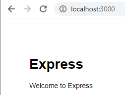

But this is only now running locally, so let's upload this to our previously created web app.


## Deploy the Express application to an Azure Web App
If you have Visual Studio Code (VSCode) installed, the simplest way of lauching it from the command line is to:
```
code .
```

You should then VSCode launch in the correct folder:

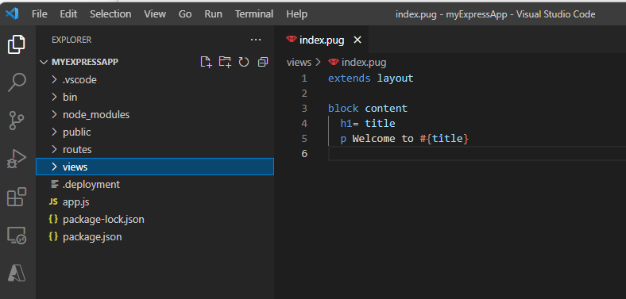

If you have the Azure extension installed, there should be an "A" icon down the left side of VSCode. 

Click on it:

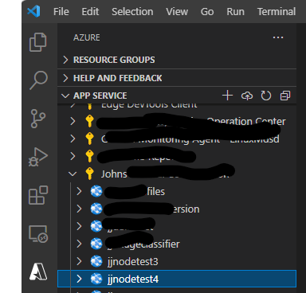

You should see your subscription and if you press the *>* arrow, it will then open and show a list of the web apps in that subscription. 
1. Choose your web app from the earlier step and right click
2. choose the item "Deploy to Web App..."
3. Pick "Yes" if it asks if you want to build on the web app
4. Pick "Deploy" - if you are sure

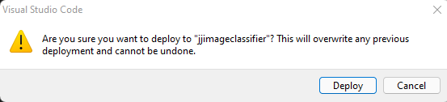

6. Wait until it completes.

## Check that your application has deployed correctly
You can now go back to the Azure portal and on the Overview click the "URL"

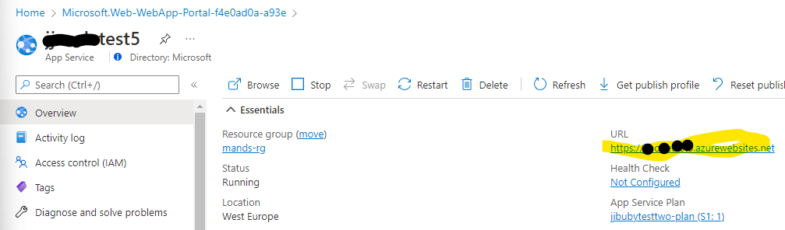

which show show the web app exactly like it was when running locally.

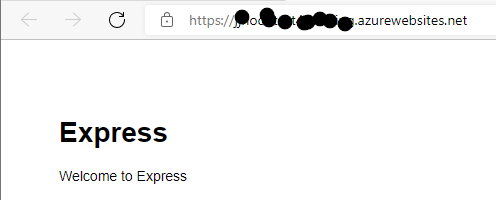

Congratulations. You now have your app on Azure!


## Blue/Green Deployments using Deployment Slots
We now want to be able to deploy our application safely. Azure app services has the notion of *deployment slots*. These allow deployments to be made to another *slot* not directly impacting the main production web site. This is documented here https://docs.microsoft.com/en-us/azure/app-service/deploy-staging-slots

To use deployment slots, there are several stages:
1. Create a deployment slot for our web application. 
2. Amend our application so this can represent a new version or release of our software
3. Deploy this version to the deployment slot
4. Either *swap* the slots - for a full deployment to tyhe new version
5. Or, only send a percentage of requests to the new slot - sometimes known as a canary release
6. Show that a deployment can be backed-out by swapping the slots again

### Create a deployment slot "staging"
The web app has a section "deployment slots". Choose this and then "Add Slot"

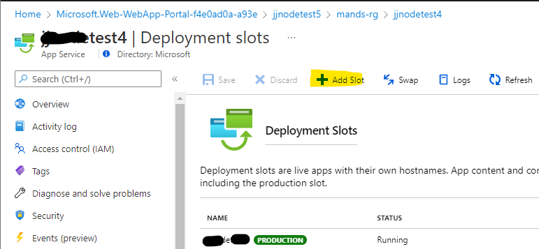

You can name it anything you like, but *staging* is most meaningful in this context:

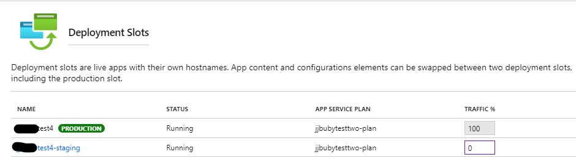

### Amend application to represent a new release
In VS Code amend your app and then save it.

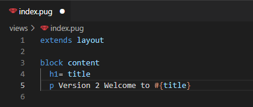

### Deploy to the "staging" slot
This deploy is very similar to the previous deployment, but inside the Azure extension for VSCode, you navigate inside the web app using the *>* and then select your named slot (should be "staging")

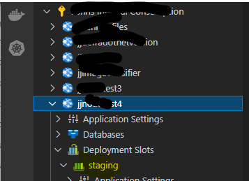

Follow all of the questions until you can see that it has deployed.

### Check the main application
This should be no different as you should have deployed to the staging slot only.


### Swap slots
Choose *swap* and then on the confirmation dialog, press the *swap* button.

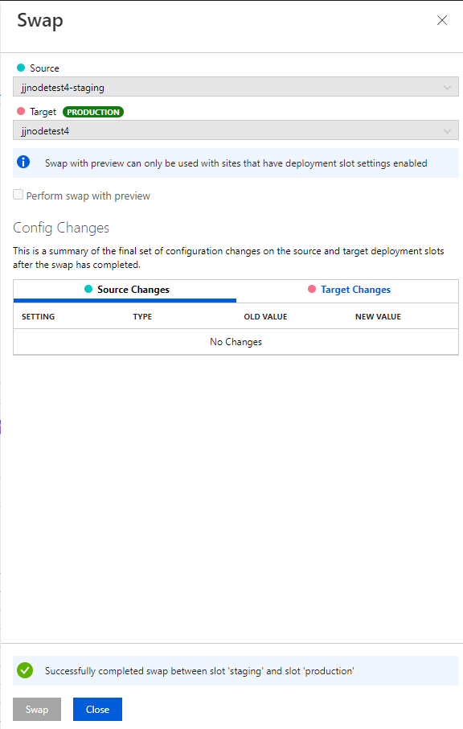

This can often take a minute or two. There then should be a confirmation - close the dialog.

Your application on the main URL should now look like this:

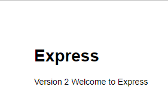

### Canary deployment
This is a little different to a slot swap, but what we intend here is to use both slots and get app services to push a percentage of requests to the staging slot and then the remainder to the main production slot.

This is done by choosing the main web application (not the staging one) and then alter the percentage to the staging and save.

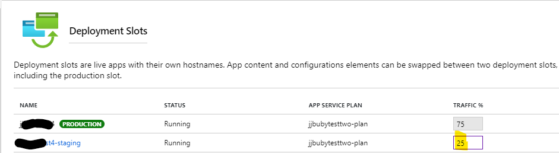

Once this has completed, the web application will serve a ratio of requests from clients. So, in the case above 25% will go to the staging slot and 75% to the main production slot. This can be tested, but this is best in incognito/InPrivate sessions as once one client hits one of the slots, it is sticky.

### Backing out a release
This is straightfoward - it is essentially reversing the previous steps.
1. If a full slot swap was done, then swap again
2. If a canary style deployment, then you should then set the staging slot to now be 0%

Check this out for yourself by doing some experiments. It may be useful to use new browser sessions for each test. 


## Injecting variables and secrets into a web app
This simplest route to injecting variables into your app code is to use *environment variables* these can be then set at a command prompt before running your app and the app can then be amended to pick up a value from an environment variable. App services uses this mechanism to allow you to set a variable in the Azure portal and for your application to the pick it up and use it. 

The same mechanism may be used for *secrets*, such as connection strings to databases.

The steps are:
1. create a variable in the app that picks up an environment variable
2. Update the app to display the variable
3. Test locally by injecting it
4. Upload the app to Azure
5. Add an "Application Setting" for that environment variable and set its value
6. Validate that the application setting gets picked up by the application

### Create an environment variable
This is only needed to be able to locally test the application before deployment. It will not get used by the app service, becasue it is local to your machine.

How to create an environment variable and set its value will depend on which operating system:
```
## Windows
set TITLE=john

## Linux
TITLE=john
```
Now let's use it.

### Update application to display the environment variable's value
You can do almost anything here, but a simple change to our sample application is to update its controller for its main route, so the file *routes/index.js*

```javascript
var express = require('express');
var router = express.Router();
var titletext = process.env.TITLE

/* GET home page. */
router.get('/', function(req, res, next) {
  res.render('index', { title: titletext });
});

module.exports = router;
```
This creates a variable *titletext* and sets its value to that of the environment variable *TITLE*.

### Test locally
You can run the application with:
```
npm start
```
Then validate that the output has changed

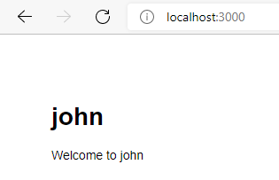

### Upload the application
This is exactly the same process as earlier, going into VSCode and deploying the application from there.

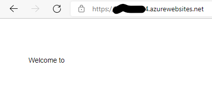

But there's a problem! We have not set the environment variable for the web application. So let's do that next...

### Set Application Setting
In an app service, the environment variables can be injected into the app runtime by values in *Application Settings*.

Go to Configuration/Application Settings and add a "New Application Setting" called "TITLE" and set its value:

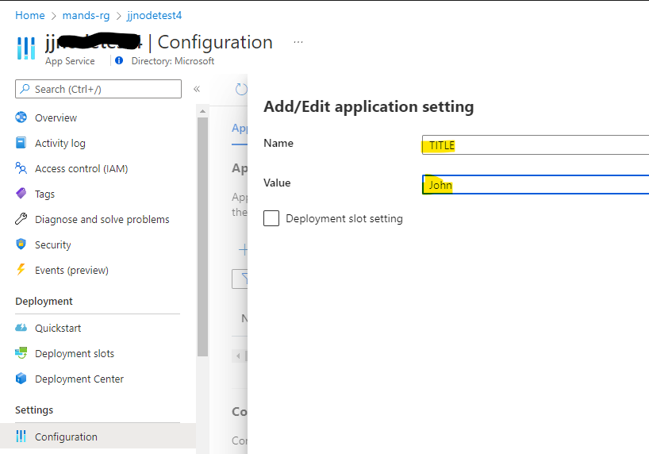

Make sure to also hit "Save" after this dialog. It may also be necessary to *Restart* the web application after this

### Web app with application setting correctly set.

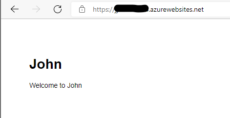

This is good, but if this varable is really a secret, such as a connection string, we can do better!


## Using Azure Key Vault to hold secrets
To recap so far. We have a web app deployed into app services and we can inject variables. Having these values set in *Application Settings* is much better than having these directly in code - especially so for secrets. But someone with access to the web application in the Azure portal could then read this value. Not ideal if this is a secret.

In this section, the plan is to use an Azure service called *key vault* to store a secret and then to configure the web app to use this value. Here are the steps we will go through:
1. Create a key vault
2. Create a secret of the same name as the environment variable from previous step (but different value)
3. Enable the web app to access the KV by using managed identity (including RBAC to KV)
4. Replace the application setting with a *key vault reference*
5. Check application
6. Look in Kudu at environment variables

Let's start.

### Create a key vault
A key vault is, like its name suggests, a place for holding secrets. A key vault is a separate Azure service that needs to be provisioned and later configured.

Search for "key vault":

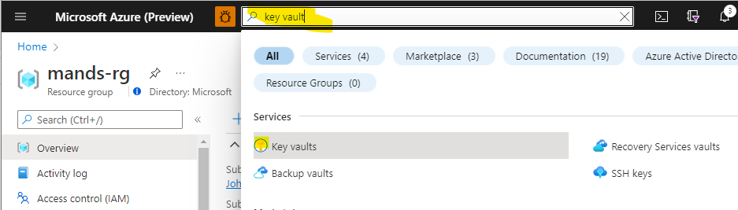

Choose key vault and *Create*:

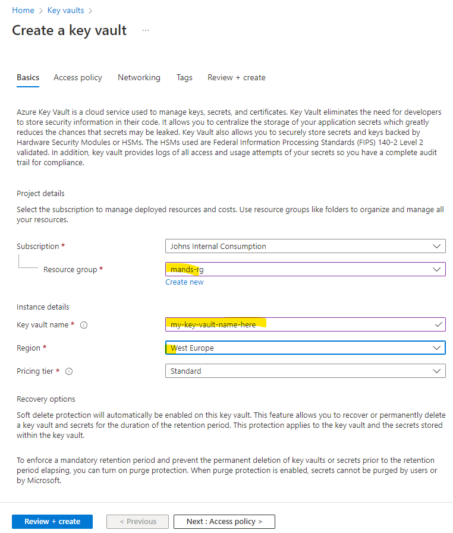
